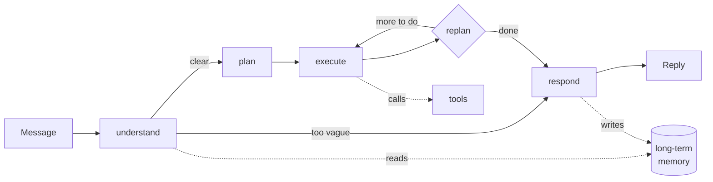

# Trip Planner Agent

An AI travel-planning agent that plans personalised trips using dynamic tool
selection, two distinct memory systems, and multi-hop retrieval over curated
travel guides.

Ask it for two days in Kyoto and it works out which neighbourhoods suit you,
finds real places inside them, checks the weather, respects the dietary
requirement you mentioned three sessions ago, and answers in whatever language
you wrote in.

```
POST /api/v1/chat
{ "message": "Plan me 2 relaxed days in Kyoto. I'm vegetarian." }
```

- **Live API** — _deployment URL goes here once deployed_
- **Interactive docs** — `/docs` (OpenAPI/Swagger, generated from the code)
- **Technical document** — [docs/TECHNICAL_DOCUMENT.md](docs/TECHNICAL_DOCUMENT.md)
  — architecture, tools, setup, evaluation and limitations in one place
- **Design rationale in depth** — [docs/ARCHITECTURE.md](docs/ARCHITECTURE.md)
- **Plain-language walkthrough** — [docs/WORKFLOW.md](docs/WORKFLOW.md)
- **How to run and verify it yourself** — [docs/TESTING.md](docs/TESTING.md)
- **A measured diagnostic pass** — [docs/AUDIT.md](docs/AUDIT.md)

---

## Contents

- [What it does](#what-it-does)
- [How it works](#how-it-works)
- [Setup](#setup)
- [Running it](#running-it)
- [API reference](#api-reference)
- [Testing](#testing)
- [Deployment](#deployment)
- [Project layout](#project-layout)
- [Known limitations](#known-limitations)

---

## What it does

### Plans before it acts

A planner breaks the request into steps, an executor carries each one out with
tools, and a replanner revises the plan when a step fails or turns out to be
unnecessary. The plan and every step are stored, so you can read back exactly
what the agent decided and why.

### Chooses its own tools

Eight tools. **Nothing is keyword-routed** — the model decides which to call
from their descriptions alone, and the same toolbox produces different choices
for different questions:

| Tool | Source | Key needed |
|---|---|---|
| `search_travel_guide` | Wikivoyage (multi-hop RAG) | no |
| `find_places` | Geoapify / OpenStreetMap | yes (free) |
| `get_weather_forecast` | Open-Meteo | **no** |
| `search_web` | Tavily | yes (free) |
| `search_flights` | Mock provider | no |
| `search_accommodation` | Mock provider | no |
| `recall_user_preferences` | Long-term memory | — |
| `save_user_preference` | Long-term memory | — |

*"Will I need an umbrella in Kyoto?"* → weather only.
*"Plan 2 days in Kyoto"* → guide → places → weather → maybe web search.

### Remembers you across sessions

Two separate systems, not one:

- **Short-term** — the running conversation, persisted so it survives a
  restart.
- **Long-term** — durable facts extracted from what you say, embedded, and
  retrieved by meaning in *any* future session about *any* city.

The long-term path is a real pipeline, not a saved chat log: extract →
filter → embed → **deduplicate and reconcile** → store → retrieve. Tell it
you are vegetarian five times and it stores **one** memory with a mention
count of five. Change your mind about budget and the old belief is retired
with an audit trail.

### Retrieves in chained steps

Each retrieval's query is built from the previous one's results:

1. Read the city article, get its **actual district list** from the API.
2. Pick the districts that suit you → fetch **those specific** articles.
3. Cross-reference each of your requirements against those districts.
4. Check whether anything is still missing; fill one gap if so.

Step 2 is impossible without step 1 — the district names are looked up, not
guessed.

### Shows its work while it works

A full plan is roughly fifty model calls and fifty tool calls. Each one is
fast, but the total is a minute or two — and a minute of blank screen is
indistinguishable from a crash. `POST /api/v1/chat/stream` narrates the run
as it happens:

```
Reading your message
Working out a plan · 5 steps
  ✓ Reading travel guides
  ✓ Finding places
  ✓ Checking the weather
Writing your answer                                    47s
```

Same body as the plain endpoint in the final event, so nothing needs a second
request.

### Runs on your own machine when the cloud runs out

Groq's free tier caps **tokens per day**, and that is the one failure a second
API key cannot fix. With Ollama installed the agent falls back to a local model
rather than giving up, and every reply is labelled with which one served it —
`groq`, `local`, or `groq → local` when the budget ran out mid-turn. A switch
in the composer forces local outright, for working offline or to stop spending
quota while testing.

Measured on a 4GB laptop GPU: `llama3.2:3b` runs at 47.8 tok/s and emits
correct tool calls; `llama3.1:8b` is equally correct but six times slower
because it does not fit in VRAM; `qwen3:4b` produces no tool calls at all and
cannot drive the executor. Local is a quota fix, not a speed fix.

### Says where every number came from

The trip panel beside the conversation shows the map, weather, stays and
flights as they are found. Each panel carries its source, and the ones backed
by the mock provider are badged **Simulated** in their own colour — because a
generated hotel price rendered like a measured forecast is the most
misleading thing a travel app can put on a screen. Swap in a real provider and
the badge changes itself; it reads the payload rather than a list.

Panels also say when they are empty: *"Ask about hotels and they appear here"*
beats rendering nothing, which looks identical to being broken.

### Puts places on a map, with photographs

Both appear in ordinary conversation, not only in a finished itinerary — most
conversations never reach a full plan, and a list of region names is no help
to someone who does not already know where those regions are.

Pins are checked rather than trusted. Geocoders answer confidently when they
should not: asked for "Catskill Mountains, New York" the POI geocoder cannot
find the Catskills and returns *Manhattan*, and a distance check cannot catch
that because the wrong answer is zero kilometres from where you were looking.
So the match type and confidence are read, and anything that only resolved the
qualifier is discarded. Fewer pins, no wrong ones.

Mapbox GL renders the map, with street, satellite and terrain styles. It needs
a free token (`NEXT_PUBLIC_MAPBOX_TOKEN`); without one the map area stays
empty and a console warning says so, while the rest of the interface carries on
working. Photographs come from Wikivoyage, Wikipedia and Wikimedia Commons, all
keyless, and anything that is not a picture of the exact place is labelled as
representative rather than passed off as real.

### Also

- **Asks before guessing.** Too vague to plan? One short clarifying question —
  but never about something it already knows about you.
- **Replies in your language.** Retrieval still runs in English, so answer
  quality does not depend on the language you asked in.
- **Respects hard constraints.** Dietary, accessibility and pet requirements
  are passed to tools as *filters*, not hints.
- **Degrades instead of failing.** A dead weather API costs you the forecast,
  not the itinerary.

### Starts working without an account

There is no login wall. Opening the planner provisions an anonymous Supabase
session, so a reviewer goes from the landing page to a working agent in one
click. That is a change to the *front door*, not to the security model: an
anonymous session is a genuine Supabase identity with a signed JWT, so the API
still verifies every request and row level security still isolates every
traveller against a real `auth.uid()`. The session persists in the browser,
which is also what makes long-term memory demonstrable — close the tab, come
back, and it still knows you are vegetarian.

Signing in still exists at `/login`; it is simply only needed for the admin
trace dashboard, which reads across users and therefore needs a role the
service role has granted.

### Shows how much quota is left before you run out

Groq's binding limit is **tokens per day per model**, and it is reported in no
header — so the first sign of exhaustion is normally the agent failing
mid-plan. The composer carries a meter: remaining tokens across every
configured key, and a breakdown per key and per model.

It is honest about what it knows. The figures are counted from what this
server has spent since it started, so they are labelled an estimate — until
Groq refuses a call and quotes real numbers in the 429 body, at which point
that model flips to **measured** and the quoted figure replaces the
arithmetic.

The same status call reports whether a local model is reachable. On the hosted
deployment it is not — Ollama runs on your machine, not Render's — so the
Local AI switch disables itself and says why, instead of accepting the click
and failing thirty seconds into a plan.

---

## How it works



Full detail in [docs/ARCHITECTURE.md](docs/ARCHITECTURE.md); a non-technical narration in
[docs/WORKFLOW.md](docs/WORKFLOW.md).

---

## Setup

**Prerequisites:** Python 3.11–3.13, and a Supabase account.

Everything below is free and needs no credit card. About 15 minutes.

### 1. Clone and install

```bash
git clone <your-repo-url>
cd "TRIP PLANNER/backend"

python -m venv .venv
# macOS/Linux
source .venv/bin/activate
# Windows
.venv\Scripts\activate

pip install -e ".[dev]"
```

### 2. Get API keys

| Service | Where | Free tier |
|---|---|---|
| **Groq** (LLM) | [console.groq.com](https://console.groq.com) → API Keys | **100k tokens/day, per model** — see note |
| **Google AI Studio** (embeddings) | [aistudio.google.com/apikey](https://aistudio.google.com/apikey) | generous |
| **Tavily** (web search) | [app.tavily.com](https://app.tavily.com) | 1,000 credits/mo |
| **Geoapify** (places) | [myprojects.geoapify.com](https://myprojects.geoapify.com) | 3,000 credits/day |
| **Supabase** (database + auth) | [supabase.com](https://supabase.com) → New project | 500 MB, 50k users |
| **Mapbox** (map tiles, optional) | [account.mapbox.com](https://account.mapbox.com/access-tokens/) | 50k map loads/mo |

Open-Meteo and Wikivoyage need no key. Mapbox is the only optional one: without
it every panel still works and the map area stays blank.

> **The Groq limit that actually bites is tokens per day, not requests.**
> 100,000 per model per account, and it appears in *no response header* — the
> `x-ratelimit-*` headers only describe the per-minute window, so a key can
> report plenty remaining while being completely out of daily budget. One full
> plan costs 30–40k. `GROQ_API_KEY` accepts a comma-separated list and keys
> from separate accounts each get their own allowance.

<details>
<summary><b>Optional: run it locally with Ollama (no quota at all)</b></summary>

Install [Ollama](https://ollama.com), then:

```bash
ollama pull llama3.2:3b      # planner, executor, utility — tool calls work
ollama pull nomic-embed-text # optional, replaces cloud embeddings
```

Nothing else to configure: `LLM_PROVIDER` defaults to `auto`, which uses Groq
and falls back to local only when the daily budget is spent. Set it to `local`
to stay off the cloud entirely, or `groq` to disable the fallback.

Two things worth knowing before you rely on it:

- **It is slower, not faster.** Local is the answer to running out of quota,
  not a way to get faster replies.
- **Model Selection:** We use `llama3.1:8b` for both planning and chatting (execution). 
  While smaller models like `3b` are faster, they struggle to follow strict negative 
  constraints (e.g. they invent descriptive themes instead of concrete place names, 
  which breaks the map and image scraper). The 8B model perfectly formats places and 
  options, ensuring your Local AI mode looks just as good as the Cloud AI mode.
- **It cannot be deployed on a free tier.** Ollama plus a model needs
  gigabytes of RAM; Render's free instance has 512 MB. This is a
  development-machine feature. Deployments keep using Groq and Gemini.

</details>

### 3. Set up Supabase

1. Create a project. **Save the database password** — it goes in
   `DATABASE_URL` and is not shown again.
2. Run the migrations in order. In the dashboard: **SQL Editor → New query**,
   then paste and run each of `supabase/migrations/0001…0009` in sequence.
   They are idempotent, so re-running is safe.
3. **Authentication → Sign In / Providers → enable "Allow anonymous
   sign-ins".** The app provisions a session on arrival instead of showing a
   login form, and that switch is off by default in new projects — without it
   every visitor sees "Could not start a session".
4. Collect the credentials:
   - **Project Settings → Data API** → Project URL
   - **Project Settings → API Keys** → `anon` and `service_role`
   - **Project Settings → Database → Connection string → URI** — use the
     **session pooler on port 5432**, *not* the transaction pooler on 6543.
     The checkpointer needs prepared statements, which 6543 does not support.

<details>
<summary><b>Optional: Google sign-in</b></summary>

1. In Google Cloud Console, create an **OAuth 2.0 Client ID** (Web
   application).
2. Authorised redirect URI:
   `https://<your-project-ref>.supabase.co/auth/v1/callback`
3. In Supabase: **Authentication → Providers → Google**, paste the client ID
   and secret, enable.
</details>

<details>
<summary><b>The admin trace dashboard</b></summary>

**On this demo deployment it is open to everyone**, via
`PUBLIC_ADMIN_DASHBOARD=true`. That is deliberate: the trace dashboard is the
evidence for most of what this README claims — that tool selection is dynamic,
that retrieval genuinely chains, that a specific answer was shaped by specific
remembered facts — and asking a reviewer to obtain credentials before they can
check any of it defeats the point of showing the work. The trade is that
visitors can see one another's trips, which is acceptable for a demo holding
no real user data and wrong for anything else.

**For a deployment with real users, leave it `false`** (the default) and
promote one account instead. Sign in once at `/login` — the route still
exists, it is simply not required any more — which creates the profile row,
then in the Supabase SQL Editor:

```sql
select public.promote_to_admin('you@example.com');
```

This must be done server-side by design: `app_role` is protected by a trigger,
so an authenticated user cannot promote themselves even with a crafted request.
Verified — see migration `0008`.
</details>

### 4. Configure

```bash
cp .env.example .env    # from the repository root
```

Fill in the values. Every variable is documented in place with where to get
it. `.env.example` is the complete inventory — nothing reads the environment
outside `app/core/config.py`.

---

### 5. Frontend (optional but recommended)

The chat and admin interface is a separate Next.js app.

```bash
cd frontend
npm install
cp .env.example .env.local
```

Fill in `.env.local`:

```
NEXT_PUBLIC_SUPABASE_URL=https://your-project-ref.supabase.co
NEXT_PUBLIC_SUPABASE_ANON_KEY=your_anon_key_here
NEXT_PUBLIC_API_URL=http://localhost:8000
NEXT_PUBLIC_MAPBOX_TOKEN=pk.your_mapbox_public_token_here   # optional
```

All of these are `NEXT_PUBLIC_` and visible in the browser bundle, which is
correct for each: the anon key is designed to be public and is constrained by
row level security, and a Mapbox public token is scoped to exactly that use.
**Never put the `service_role` key here** — it bypasses RLS entirely.

---

## Running it

Two processes. Start the backend first.

```bash
# Terminal 1 — API
cd backend
python run.py

# Terminal 2 — UI
cd frontend
npm run dev
```

- API — <http://localhost:8000>
- **Interactive docs — <http://localhost:8000/docs>**
- Liveness — <http://localhost:8000/health>
- Diagnostics — <http://localhost:8000/health/ready>

`/health/ready` reports each dependency separately and is the first place to
look if something misbehaves.

> **Running without any credentials:** the app starts with in-memory stores so
> you can explore `/docs`. Nothing persists across a restart, and
> `/health/ready` will say so.

> **Windows — use `python run.py`, not `uvicorn` directly.** uvicorn selects
> `ProactorEventLoop` on Windows, and psycopg's async mode cannot use it: every
> database call fails and the app quietly falls back to in-memory stores while
> `/health/ready` reports the database as unconfigured. `run.py` pins
> `SelectorEventLoop`. Linux, macOS and the Docker image are unaffected.
>
> Also set `PYTHONIOENCODING=utf-8` before running tests, or non-Latin
> assertions raise `UnicodeEncodeError` from the console encoder.

---

## API reference

Full interactive documentation at **`/docs`**, generated from the code so it
cannot drift. All endpoints except `/health` require
`Authorization: Bearer <supabase-access-token>`.

### Send a message

```bash
curl -X POST http://localhost:8000/api/v1/chat \
  -H "Authorization: Bearer $TOKEN" \
  -H "Content-Type: application/json" \
  -d '{"message": "Plan me 2 relaxed days in Kyoto. I am vegetarian."}'
```

```jsonc
{
  "session_id": "3f2a9c1e-...",     // reuse this for follow-ups
  "run_id": "8b7d4e2f-...",         // look up the full trace with this
  "response": "Here's a relaxed two days in Kyoto...",
  "status": "completed",
  "needs_clarification": false,
  "detected_language": "en",
  "destination": "Kyoto",
  "plan": [
    { "description": "Research Kyoto districts suiting a slow pace", "kind": "research" },
    { "description": "Find vegetarian dining options", "kind": "research" },
    { "description": "Compose the itinerary", "kind": "compose" }
  ],
  "tool_calls": [
    { "tool": "search_travel_guide", "status": "ok", "source": "wikivoyage", "latency_ms": 2410 },
    { "tool": "find_places", "status": "ok", "source": "geoapify", "latency_ms": 380 }
  ],
  "steps_executed": 3,
  "replan_count": 0,
  "latency_ms": 11840
}
```

**A vague request gets a question instead:**

```bash
-d '{"message": "I want to go somewhere nice"}'
```
```jsonc
{
  "response": "I'd love to help. Which city or country did you have in mind?",
  "status": "clarifying",
  "needs_clarification": true
}
```

**Another language works end to end:**

```bash
-d '{"message": "京都で2日間の旅程を立ててください。ベジタリアンです。"}'
# → detected_language: "ja", response in Japanese, memory stored in English
```

### Endpoints

| Method | Path | Purpose |
|---|---|---|
| `POST` | `/api/v1/chat` | Send a message |
| `POST` | `/api/v1/chat/stream` | Same, streamed — progress events, then the reply |
| `GET` | `/api/v1/sessions` | List your conversations |
| `GET` | `/api/v1/sessions/{id}` | One conversation with messages |
| `DELETE` | `/api/v1/sessions/{id}` | Archive a conversation |
| `GET` | `/api/v1/me/memories` | **See what it remembers about you** |
| `DELETE` | `/api/v1/me/memories/{id}` | Forget one thing |
| `POST` | `/api/v1/me/memory-settings` | Turn memory off |
| `DELETE` | `/api/v1/me/data` | Erase everything |
| `GET` | `/api/v1/system/status` | Local-model availability and remaining Groq quota |
| `GET` | `/api/v1/admin/users` | *(admin)* All users |
| `GET` | `/api/v1/admin/users/{id}` | *(admin)* Profile, sessions, memories |
| `GET` | `/api/v1/admin/runs/{id}` | *(admin)* **Full execution trace** |
| `GET` | `/api/v1/admin/analytics/tools` | *(admin)* Tool usage and failures |
| `GET` | `/api/v1/admin/analytics/memory` | *(admin)* Memory health |
| `GET` | `/api/v1/admin/audit-log` | *(admin)* Who looked at what |

> **See the memory working:** hold a conversation mentioning a preference,
> then call `GET /api/v1/me/memories`. Start a *new* session about a different
> city and the preference is applied without you repeating it.

Errors share one envelope:

```json
{ "error": { "code": "rate_limited", "message": "...", "details": {}, "retryable": true } }
```

---

## Testing

**[docs/TESTING.md](docs/TESTING.md) is the full runbook** — how to start
everything, and a step-by-step recipe for verifying each claim in this README
yourself.

Three helper scripts:

```bash
# Check every credential and service with a real call
python scripts/verify_setup.py

# Apply the SQL migrations (alternative to pasting them into the SQL editor)
python scripts/apply_migrations.py

# End-to-end functional test against a running API
python scripts/smoke_test.py --email you@example.com --password '...'

# Erase every conversation, memory and trace, leaving the schema intact.
# Counts first and changes nothing unless --apply is passed.
python scripts/reset_data.py
python scripts/reset_data.py --apply --keep-rag-cache
```

The unit suite:

```bash
cd backend
PYTHONIOENCODING=utf-8 pytest -q                     # 248 tests
pytest --cov=app --cov-report=term-missing
pytest tests/unit/test_memory_consolidation.py -v    # the memory pipeline
```

No network, no database, no API keys. Notable coverage:

- **Memory** — the three similarity bands, contradiction supersession with
  audit trail, cross-user isolation, the CJK length-floor regression.
- **Key rotation** — round-robin spread, rate-limited keys skipped, cooldown
  expiry, broken-key detection, and that pool status never leaks a full key.
- **Tools** — every failure mode degrades rather than raising; no tool schema
  leaks `user_id`; a scan asserting the forbidden keyword-routing pattern is
  absent.
- **Agent** — budget enforcement, all four loop exits, grounding detection.
- **RAG** — that hop 2's documents are disjoint from hop 1's, which is what
  makes the retrieval genuinely multi-hop.

---

## Deployment

Three services, all on genuine free tiers, no card required:

| Part | Platform | Why |
|---|---|---|
| API (FastAPI, Docker) | **Render** free web service | 512 MB, no card, Singapore region next to the database |
| Web (Next.js) | **Vercel** Hobby | Next.js is Vercel's own framework; zero configuration |
| Database | **Supabase** free | Already the datastore — nothing further to deploy |

Railway is *not* a free option any more: after a 30-day trial it requires a
minimum of $1/month, caps a project at 0.5 GB RAM, and allows one project —
which will not hold an API and a database together.

### 1. Database

Follow [Setup → Set up Supabase](#3-set-up-supabase). Confirm anonymous
sign-ins are enabled, or the deployed site cannot create sessions.

### 2. API on Render

1. Push the repository to GitHub.
2. Render → **New → Blueprint** → select the repository. It reads the
   committed [`render.yaml`](render.yaml), so the service, region, health check
   path and non-secret configuration are already described.
3. Supply the secrets it prompts for — everything marked `sync: false`:
   `GROQ_API_KEY`, `GEMINI_API_KEY`, `TAVILY_API_KEY`, `GEOAPIFY_API_KEY`,
   `SUPABASE_URL`, `SUPABASE_ANON_KEY`, `SUPABASE_SERVICE_ROLE_KEY`,
   `SUPABASE_JWKS_URL`, `DATABASE_URL`, `HTTP_USER_AGENT`.
   - `DATABASE_URL` must be the **session pooler on 5432**, not 6543.
   - `HTTP_USER_AGENT` must name a real contact, or Wikimedia returns 403.
4. Leave `CORS_ORIGINS` for now — the frontend does not have a URL yet.
5. Deploy, then check `https://<your-api>.onrender.com/health/ready` reports
   `"ready": true`.

### 3. Web on Vercel

1. Vercel → **Add New → Project** → import the same repository.
2. Set **Root Directory** to `frontend`. Everything else is detected.
3. Environment variables:
   ```
   NEXT_PUBLIC_SUPABASE_URL        https://<ref>.supabase.co
   NEXT_PUBLIC_SUPABASE_ANON_KEY   <anon key>
   NEXT_PUBLIC_API_URL             https://<your-api>.onrender.com
   NEXT_PUBLIC_MAPBOX_TOKEN        pk.…        (optional)
   ```
4. Deploy.

### 4. Close the loop

1. Back in Render, set `CORS_ORIGINS` to the Vercel URL — exactly, with the
   scheme and no trailing slash. The API sends credentials, so the origin list
   is explicit and `*` is neither accepted nor safe.
2. In Supabase → **Authentication → URL Configuration**, add the Vercel URL to
   **Site URL** and **Redirect URLs**.
3. Add the repository secret `API_URL` (your Render URL) so the keep-warm
   workflow can reach it.

### The two free-tier facts, handled rather than hidden

- Render sleeps after **15 minutes** idle (30–60 s cold start).
- Supabase pauses a project after **7 days** of no database activity.

[`.github/workflows/keep-warm.yml`](.github/workflows/keep-warm.yml) pings
`/health/ready` every 10 minutes, which fixes both — that endpoint touches the
database, so it counts as activity. Note the arithmetic: Render grants 750
free instance-hours a month and staying awake continuously costs about 720, so
this fits, but only for a single free service. On a paid plan, delete the
workflow.

---

## Project layout

```
backend/app/
├── core/         config, logging, errors, security   ← imports nothing from app
├── services/     llm, embeddings, http               ← one per external system
├── db/           session (RLS scoping), repositories ← all SQL lives here
├── providers/    flights                             ← swappable backends
├── tools/        8 tools + registry                  ← the model's action surface
├── memory/       short_term + extractor/consolidator/store/service
├── rag/          corpus, chunking, index, retriever
├── agent/        state, trip_state, graph, runner, nodes/
└── api/          deps + v1/routes/
supabase/migrations/    0001–0009
```

`agent/` imports `tools/`; `tools/` never imports `agent/`. A tool that knows
about the planner cannot be tested on its own.

---

## Known limitations

Stated plainly, because a submission that hides these is worse than one that
does not.

- **Flight and hotel data is simulated.** Amadeus decommissioned its
  Self-Service API on 17 July 2026. The mock is grounded in real distances and
  a defensible pricing curve, and every response is labelled `"source":
  "mock"`, but it is not live availability. A `DuffelFlightProvider` exists
  behind the same interface if a key is supplied.
- **First request after idle is slow** on the free tier — cold start, plus a
  cold RAG cache for a city nobody has asked about yet.
- **The grounding check is a heuristic.** It flags named venues and prices
  absent from the retrieved evidence and logs them for the admin dashboard.
  It does not block the response, and it has false positives.
- **Groq's free tier is limited by tokens per _day_, per model.** Measured
  against the live API: **100,000 tokens/day** for
  `llama-3.3-70b-versatile`, and the figure appears in *no response header*.
  The `x-ratelimit-*` headers describe only the per-minute window (12,000 TPM
  for that model), so a key can report "11,959 tokens remaining" while being
  entirely out of daily budget. The only place the daily number is ever stated
  is the body of the 429 it eventually returns.

  An earlier version of this document diagnosed the ceiling as *per minute*
  and was wrong for exactly that reason — the headers were believed over the
  behaviour. One full itinerary costs 30–50k tokens, because the executor
  resends its tool schemas and accumulated findings on every ReAct round trip,
  so a single key is worth roughly two or three complete plans a day.

  Two things follow. `GROQ_API_KEY` takes a comma-separated list and keys from
  **separate accounts** each carry their own 100k allowance; the pool rotates
  across them. And because the budget is per *model*, a spent bucket is not
  the end — `models_for_role` steps down a fallback chain, so an exhausted
  executor model moves to another rather than failing.

  The composer shows the remaining estimate so this is visible before it
  bites, and when everything really is spent the agent says so plainly rather
  than blaming the travel data sources, which answered fine.
- **Wikivoyage coverage is uneven.** Major cities have rich district articles;
  smaller destinations may have only one page, in which case hop 2 is skipped
  and `stopped_because` says so.

---

## Licence

MIT. Retrieved travel content is from Wikivoyage under CC BY-SA 4.0; place
data is from OpenStreetMap under ODbL.
