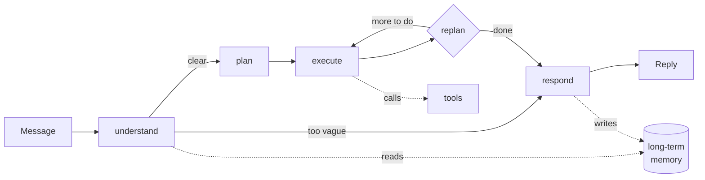

# Trip Planner Agent

An AI travel-planning agent that plans personalised trips using dynamic tool
selection, two distinct memory systems, and multi-hop retrieval over curated
travel guides.

Ask it for two days in Kyoto and it works out which neighbourhoods suit you,
finds real places inside them, checks the weather, respects the dietary
requirement you mentioned three sessions ago, and answers in whatever language
you wrote in.

```
POST /api/v1/chat
{ "message": "Plan me 2 relaxed days in Kyoto. I'm vegetarian." }
```

- **Live API** — _deployment URL goes here once deployed_
- **Interactive docs** — `/docs` (OpenAPI/Swagger, generated from the code)
- **Technical document** — [ARCHITECTURE.md](ARCHITECTURE.md)
- **Plain-language walkthrough** — [WORKFLOW.md](WORKFLOW.md)

---

## Contents

- [What it does](#what-it-does)
- [How it works](#how-it-works)
- [Setup](#setup)
- [Running it](#running-it)
- [API reference](#api-reference)
- [Testing](#testing)
- [Deployment](#deployment)
- [Project layout](#project-layout)
- [Known limitations](#known-limitations)

---

## What it does

### Plans before it acts

A planner breaks the request into steps, an executor carries each one out with
tools, and a replanner revises the plan when a step fails or turns out to be
unnecessary. The plan and every step are stored, so you can read back exactly
what the agent decided and why.

### Chooses its own tools

Eight tools. **Nothing is keyword-routed** — the model decides which to call
from their descriptions alone, and the same toolbox produces different choices
for different questions:

| Tool | Source | Key needed |
|---|---|---|
| `search_travel_guide` | Wikivoyage (multi-hop RAG) | no |
| `find_places` | Geoapify / OpenStreetMap | yes (free) |
| `get_weather_forecast` | Open-Meteo | **no** |
| `search_web` | Tavily | yes (free) |
| `search_flights` | Mock provider | no |
| `search_accommodation` | Mock provider | no |
| `recall_user_preferences` | Long-term memory | — |
| `save_user_preference` | Long-term memory | — |

*"Will I need an umbrella in Kyoto?"* → weather only.
*"Plan 2 days in Kyoto"* → guide → places → weather → maybe web search.

### Remembers you across sessions

Two separate systems, not one:

- **Short-term** — the running conversation, persisted so it survives a
  restart.
- **Long-term** — durable facts extracted from what you say, embedded, and
  retrieved by meaning in *any* future session about *any* city.

The long-term path is a real pipeline, not a saved chat log: extract →
filter → embed → **deduplicate and reconcile** → store → retrieve. Tell it
you are vegetarian five times and it stores **one** memory with a mention
count of five. Change your mind about budget and the old belief is retired
with an audit trail.

### Retrieves in chained steps

Each retrieval's query is built from the previous one's results:

1. Read the city article, get its **actual district list** from the API.
2. Pick the districts that suit you → fetch **those specific** articles.
3. Cross-reference each of your requirements against those districts.
4. Check whether anything is still missing; fill one gap if so.

Step 2 is impossible without step 1 — the district names are looked up, not
guessed.

### Also

- **Asks before guessing.** Too vague to plan? One short clarifying question —
  but never about something it already knows about you.
- **Replies in your language.** Retrieval still runs in English, so answer
  quality does not depend on the language you asked in.
- **Respects hard constraints.** Dietary, accessibility and pet requirements
  are passed to tools as *filters*, not hints.
- **Degrades instead of failing.** A dead weather API costs you the forecast,
  not the itinerary.

---

## How it works



Full detail in [ARCHITECTURE.md](ARCHITECTURE.md); a non-technical narration in
[WORKFLOW.md](WORKFLOW.md).

---

## Setup

**Prerequisites:** Python 3.11–3.13, and a Supabase account.

Everything below is free and needs no credit card. About 15 minutes.

### 1. Clone and install

```bash
git clone <your-repo-url>
cd "TRIP PLANNER/backend"

python -m venv .venv
# macOS/Linux
source .venv/bin/activate
# Windows
.venv\Scripts\activate

pip install -e ".[dev]"
```

### 2. Get API keys

| Service | Where | Free tier |
|---|---|---|
| **Groq** (LLM) | [console.groq.com](https://console.groq.com) → API Keys | ~1,000 req/day |
| **Google AI Studio** (embeddings) | [aistudio.google.com/apikey](https://aistudio.google.com/apikey) | generous |
| **Tavily** (web search) | [app.tavily.com](https://app.tavily.com) | 1,000 credits/mo |
| **Geoapify** (places) | [myprojects.geoapify.com](https://myprojects.geoapify.com) | 3,000 credits/day |
| **Supabase** (database + auth) | [supabase.com](https://supabase.com) → New project | 500 MB, 50k users |

Open-Meteo and Wikivoyage need no key.

### 3. Set up Supabase

1. Create a project. **Save the database password** — it goes in
   `DATABASE_URL` and is not shown again.
2. Run the migrations in order. In the dashboard: **SQL Editor → New query**,
   then paste and run each of `supabase/migrations/0001…0007` in sequence.
   They are idempotent, so re-running is safe.
3. Collect the credentials:
   - **Project Settings → Data API** → Project URL
   - **Project Settings → API Keys** → `anon` and `service_role`
   - **Project Settings → Database → Connection string → URI** — use the
     **session pooler on port 5432**, *not* the transaction pooler on 6543.
     The checkpointer needs prepared statements, which 6543 does not support.

<details>
<summary><b>Optional: Google sign-in</b></summary>

1. In Google Cloud Console, create an **OAuth 2.0 Client ID** (Web
   application).
2. Authorised redirect URI:
   `https://<your-project-ref>.supabase.co/auth/v1/callback`
3. In Supabase: **Authentication → Providers → Google**, paste the client ID
   and secret, enable.
</details>

<details>
<summary><b>Making yourself an admin</b></summary>

Sign up through the app first, then in the Supabase SQL Editor:

```sql
update public.profiles set app_role = 'admin' where email = 'you@example.com';
```

This must be done server-side by design — `app_role` is protected by a trigger
so users cannot promote themselves.
</details>

### 4. Configure

```bash
cp .env.example .env    # from the repository root
```

Fill in the values. Every variable is documented in place with where to get
it. `.env.example` is the complete inventory — nothing reads the environment
outside `app/core/config.py`.

---

### 5. Frontend (optional but recommended)

The chat and admin interface is a separate Next.js app.

```bash
cd frontend
npm install
cp .env.example .env.local
```

Fill in `.env.local`:

```
NEXT_PUBLIC_SUPABASE_URL=https://your-project-ref.supabase.co
NEXT_PUBLIC_SUPABASE_ANON_KEY=your_anon_key_here
NEXT_PUBLIC_API_URL=http://localhost:8000
```

All three are `NEXT_PUBLIC_` and visible in the browser bundle, which is
correct for each: the anon key is designed to be public and is constrained by
row level security. **Never put the `service_role` key here** — it bypasses
RLS entirely.

---

## Running it

Two processes. Start the backend first.

```bash
# Terminal 1 — API
cd backend
uvicorn app.main:app --reload

# Terminal 2 — UI
cd frontend
npm run dev
```

- API — <http://localhost:8000>
- **Interactive docs — <http://localhost:8000/docs>**
- Liveness — <http://localhost:8000/health>
- Diagnostics — <http://localhost:8000/health/ready>

`/health/ready` reports each dependency separately and is the first place to
look if something misbehaves.

> **Running without any credentials:** the app starts with in-memory stores so
> you can explore `/docs`. Nothing persists across a restart, and
> `/health/ready` will say so.

> **Windows:** set `PYTHONIOENCODING=utf-8` before running tests, or non-Latin
> assertions raise `UnicodeEncodeError` from the console encoder.

---

## API reference

Full interactive documentation at **`/docs`**, generated from the code so it
cannot drift. All endpoints except `/health` require
`Authorization: Bearer <supabase-access-token>`.

### Send a message

```bash
curl -X POST http://localhost:8000/api/v1/chat \
  -H "Authorization: Bearer $TOKEN" \
  -H "Content-Type: application/json" \
  -d '{"message": "Plan me 2 relaxed days in Kyoto. I am vegetarian."}'
```

```jsonc
{
  "session_id": "3f2a9c1e-...",     // reuse this for follow-ups
  "run_id": "8b7d4e2f-...",         // look up the full trace with this
  "response": "Here's a relaxed two days in Kyoto...",
  "status": "completed",
  "needs_clarification": false,
  "detected_language": "en",
  "destination": "Kyoto",
  "plan": [
    { "description": "Research Kyoto districts suiting a slow pace", "kind": "research" },
    { "description": "Find vegetarian dining options", "kind": "research" },
    { "description": "Compose the itinerary", "kind": "compose" }
  ],
  "tool_calls": [
    { "tool": "search_travel_guide", "status": "ok", "source": "wikivoyage", "latency_ms": 2410 },
    { "tool": "find_places", "status": "ok", "source": "geoapify", "latency_ms": 380 }
  ],
  "steps_executed": 3,
  "replan_count": 0,
  "latency_ms": 11840
}
```

**A vague request gets a question instead:**

```bash
-d '{"message": "I want to go somewhere nice"}'
```
```jsonc
{
  "response": "I'd love to help. Which city or country did you have in mind?",
  "status": "clarifying",
  "needs_clarification": true
}
```

**Another language works end to end:**

```bash
-d '{"message": "京都で2日間の旅程を立ててください。ベジタリアンです。"}'
# → detected_language: "ja", response in Japanese, memory stored in English
```

### Endpoints

| Method | Path | Purpose |
|---|---|---|
| `POST` | `/api/v1/chat` | Send a message |
| `GET` | `/api/v1/sessions` | List your conversations |
| `GET` | `/api/v1/sessions/{id}` | One conversation with messages |
| `DELETE` | `/api/v1/sessions/{id}` | Archive a conversation |
| `GET` | `/api/v1/me/memories` | **See what it remembers about you** |
| `DELETE` | `/api/v1/me/memories/{id}` | Forget one thing |
| `POST` | `/api/v1/me/memory-settings` | Turn memory off |
| `DELETE` | `/api/v1/me/data` | Erase everything |
| `GET` | `/api/v1/admin/users` | *(admin)* All users |
| `GET` | `/api/v1/admin/users/{id}` | *(admin)* Profile, sessions, memories |
| `GET` | `/api/v1/admin/runs/{id}` | *(admin)* **Full execution trace** |
| `GET` | `/api/v1/admin/analytics/tools` | *(admin)* Tool usage and failures |
| `GET` | `/api/v1/admin/analytics/memory` | *(admin)* Memory health |
| `GET` | `/api/v1/admin/audit-log` | *(admin)* Who looked at what |

> **See the memory working:** hold a conversation mentioning a preference,
> then call `GET /api/v1/me/memories`. Start a *new* session about a different
> city and the preference is applied without you repeating it.

Errors share one envelope:

```json
{ "error": { "code": "rate_limited", "message": "...", "details": {}, "retryable": true } }
```

---

## Testing

```bash
cd backend
PYTHONIOENCODING=utf-8 pytest -q                     # 97 tests
pytest --cov=app --cov-report=term-missing
pytest tests/unit/test_memory_consolidation.py -v    # the memory pipeline
```

No network, no database, no API keys. Notable coverage:

- **Memory** — the three similarity bands, contradiction supersession with
  audit trail, cross-user isolation, the CJK length-floor regression.
- **Tools** — every failure mode degrades rather than raising; no tool schema
  leaks `user_id`; a scan asserting the forbidden keyword-routing pattern is
  absent.
- **Agent** — budget enforcement, all four loop exits, grounding detection.
- **RAG** — that hop 2's documents are disjoint from hop 1's, which is what
  makes the retrieval genuinely multi-hop.

---

## Deployment

Deploys to [Render](https://render.com) from the committed
[`render.yaml`](render.yaml).

1. Push to GitHub.
2. Render → **New → Blueprint** → select the repository.
3. Supply the secrets it prompts for (everything marked `sync: false`).
4. Set `CORS_ORIGINS` to your frontend's origin.

Two free-tier facts, handled rather than hidden:

- Render sleeps after **15 minutes** idle (30–60 s cold start).
- Supabase pauses a project after **7 days** of no database activity.

[`.github/workflows/keep-warm.yml`](.github/workflows/keep-warm.yml) pings
`/health/ready` every 10 minutes, which fixes both — that endpoint touches the
database, so it counts as activity. Set the repository secret `API_URL` to
your deployed URL. On a paid plan, delete the workflow.

---

## Project layout

```
backend/app/
├── core/         config, logging, errors, security   ← imports nothing from app
├── services/     llm, embeddings, http               ← one per external system
├── db/           session (RLS scoping), repositories ← all SQL lives here
├── providers/    flights                             ← swappable backends
├── tools/        8 tools + registry                  ← the model's action surface
├── memory/       short_term + extractor/consolidator/store/service
├── rag/          corpus, chunking, index, retriever
├── agent/        state, graph, runner, nodes/
└── api/          deps + v1/routes/
supabase/migrations/    0001–0007
```

`agent/` imports `tools/`; `tools/` never imports `agent/`. A tool that knows
about the planner cannot be tested on its own.

---

## Known limitations

Stated plainly, because a submission that hides these is worse than one that
does not.

- **Flight and hotel data is simulated.** Amadeus decommissioned its
  Self-Service API on 17 July 2026. The mock is grounded in real distances and
  a defensible pricing curve, and every response is labelled `"source":
  "mock"`, but it is not live availability. A `DuffelFlightProvider` exists
  behind the same interface if a key is supplied.
- **First request after idle is slow** on the free tier — cold start, plus a
  cold RAG cache for a city nobody has asked about yet.
- **The grounding check is a heuristic.** It flags named venues and prices
  absent from the retrieved evidence and logs them for the admin dashboard.
  It does not block the response, and it has false positives.
- **Rate limits are real.** Groq's free tier is roughly 1,000 requests/day and
  one turn costs 6–12. Model tiering stretches that; heavy demo traffic will
  still exhaust it.
- **Wikivoyage coverage is uneven.** Major cities have rich district articles;
  smaller destinations may have only one page, in which case hop 2 is skipped
  and `stopped_because` says so.

---

## Licence

MIT. Retrieved travel content is from Wikivoyage under CC BY-SA 4.0; place
data is from OpenStreetMap under ODbL.
