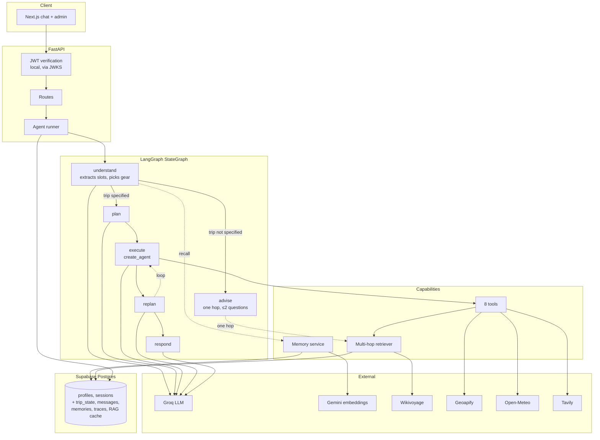
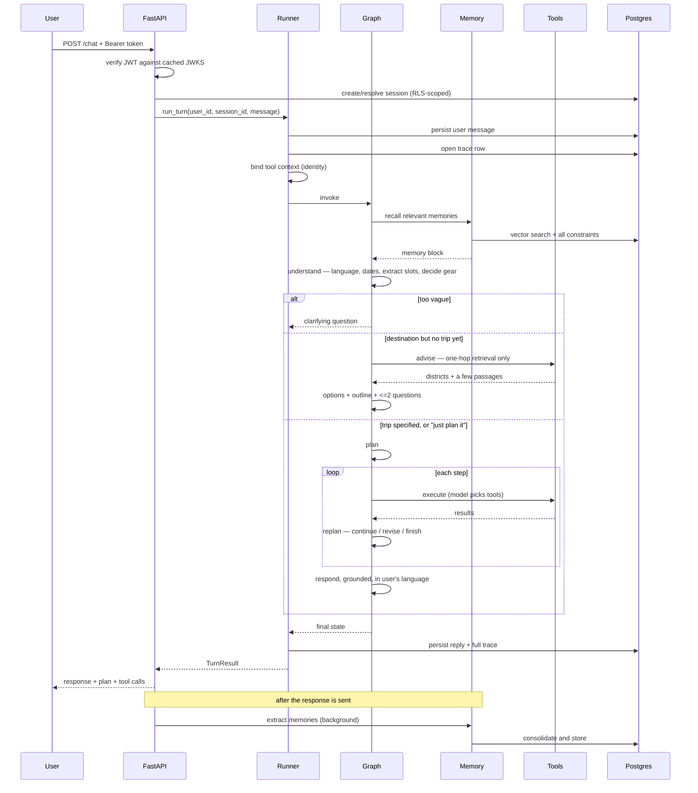
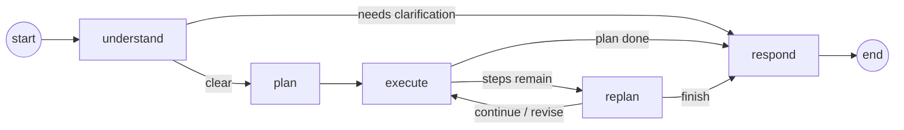
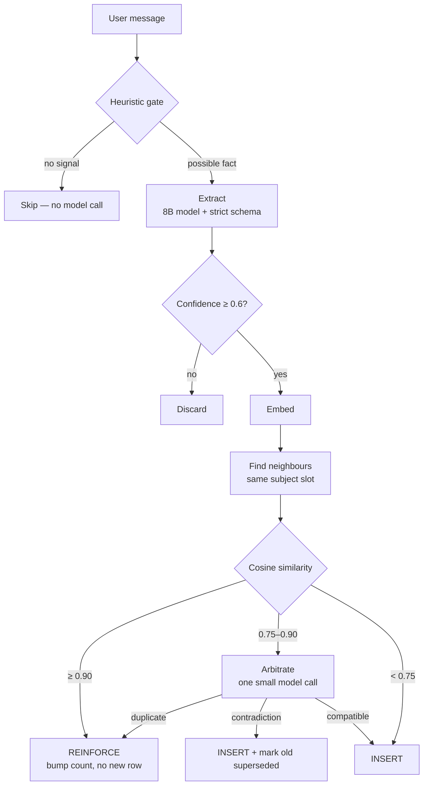
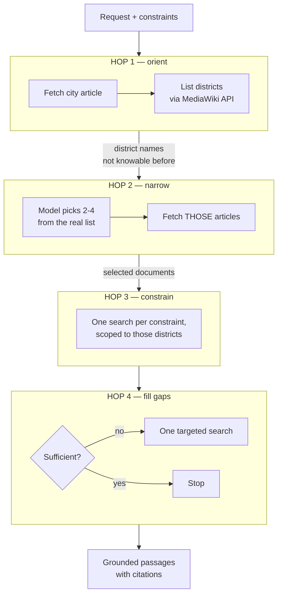
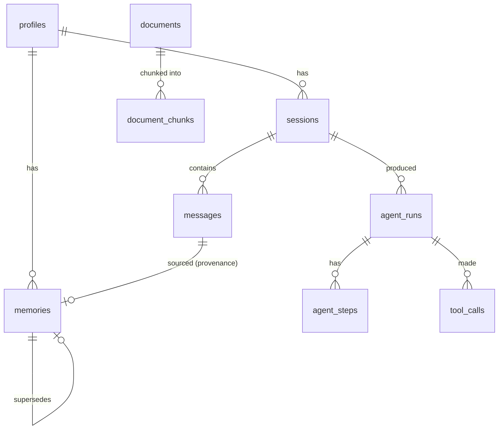
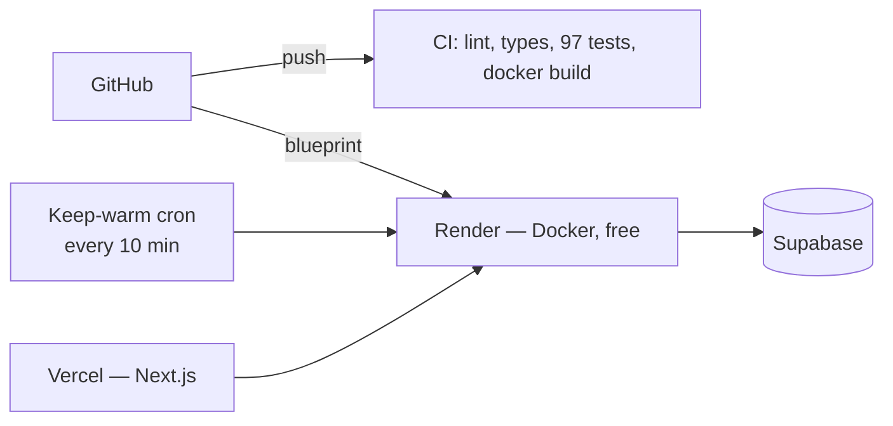

# Architecture

The technical document for the Trip Planner Agent: how the system is put
together, and why each decision went the way it did.

Written to be argued with. Where the obvious approach was rejected, the
rejected option is named and the reason given.

---

## Contents

1. [System overview](#1-system-overview)
2. [Request flow](#2-request-flow)
3. [Three gears, not one](#3-three-gears-not-one)
4. [The planning loop](#4-the-planning-loop)
5. [Tools and dynamic selection](#5-tools-and-dynamic-selection)
6. [Memory](#6-memory)
7. [Multi-hop RAG](#7-multi-hop-rag)
8. [Data model and isolation](#8-data-model-and-isolation)
9. [Multilingual support](#9-multilingual-support)
10. [Failure handling](#10-failure-handling)
11. [Latency, quota and what the traveller sees](#11-latency-quota-and-what-the-traveller-sees)
12. [Deployment](#12-deployment)
13. [Decision log](#13-decision-log)
14. [What I would do next](#14-what-i-would-do-next)

---

## 1. System overview



**Layering.** Each layer imports only from those above it:

```
core/  →  services/  →  db/  →  providers/  →  tools/  →  memory/, rag/  →  agent/  →  api/
```

The rule that keeps it honest: **`agent/` may import `tools/`; `tools/` may
never import `agent/`.** A tool that knows about the planner cannot be tested
in isolation, and testability is the point of the boundary.

---

## 2. Request flow



Two orderings in that diagram are deliberate and load-bearing:

- **Memory recall happens before the clarification decision** (§6.5).
- **Memory extraction happens after the response is sent** (§6.2).

---

## 3. Three gears, not one

An earlier version routed every clear request straight into the full
plan-execute pipeline. Live testing showed the failure: *"i want to go to
kerala"* produced a complete two-day itinerary for districts the traveller
never chose, at full pipeline cost, without once asking how long the trip was
or what mattered to them. Technically correct, conversationally wrong — a
human travel agent shown that message would talk first.

So `understand` extracts trip *slots* (origin, duration, rough timing, party,
budget, priorities) alongside the existing goal/language/clarify reading, and
`app/agent/trip_state.decide_mode` — pure code, no model call — picks the gear
for this turn:

| Gear | When | Cost |
|---|---|---|
| `clarify` | No destination, or genuinely ambiguous | One model call, no tools |
| `advise` | A destination but the trip isn't specified yet | One retrieval hop + one model call, ~3k tokens |
| `plan` | Duration + a date signal are known, or "just plan it", or a scoped request ("flights to Tokyo") | The full pipeline, ~30–50k tokens |

**Why a code decision, not a model one.** The routing rule has to be stated
and defended in one sentence per branch (see the docstring on `decide_mode`)
— "the model felt like it" is not an answer an interviewer accepts, and a
non-deterministic gear choice is untestable. The model's job stays narrow:
extraction only ("does this message state a duration?").

**The advise gear runs real retrieval, not a guess.** `advisor_node` calls the
same `MultiHopRetriever` the full pipeline uses, capped at `max_hops=1` — one
call is enough to fetch the destination's guide article and its real district
listing, so the options offered ("🌴 Backwaters — Alappuzha…") are grounded in
the corpus, not the model's prior. Verified live: Kerala's advise turn
returned four options built from real districts for 2,780 tokens, versus tens
of thousands for a full plan.

**Confirmation is sticky.** Once a turn reaches `plan`, `trip_state.
outline_confirmed` is set, so a later edit ("make day 2 lighter") refines the
existing plan instead of restarting the advisory conversation. Slots persist
per conversation in `sessions.trip_state` (JSONB, migration 0009) and merge
with *absence never erases* semantics — a follow-up that mentions no duration
does not forget the one established two turns ago.

**The advisory budget prevents an interrogation.** After
`MAX_ADVISE_ROUNDS` (2) turns of advising, `decide_mode` forces `plan` with
whatever is known rather than asking a third round of questions.

**Composer scoping.** The frontend's Flights / Attractions / Stays /
Restaurants toggles travel as `focus` on every `/chat` request. Flights and
Stays map 1:1 to tools and are *removed* from the executor's toolbox when off
— the same "absence is a guarantee, an instruction is a request" principle
`get_tools(include_memory=...)` already uses for the memory opt-out. Attractions
and Restaurants share `find_places` with everything else, so their scoping is
enforced through prompt instructions instead.

---

## 4. The planning loop

### 4.1 Why hand-built

The brief names *"LangChain's Plan-and-Execute"*. That class no longer exists:
LangChain 1.0 collapsed the old agent types into `create_agent`, and
`create_agent` is a **ReAct loop** — it picks a tool, sees the result, picks
another. It does not plan ahead.

So the planning loop is an explicit `StateGraph`:



### 4.2 `create_agent` inside the executor

The executor node **is** a `create_agent` instance. The inner tool-calling loop
— parse a tool call, run it, feed the result back, decide whether to call
another — is a solved problem with maintained edge-case handling. Rewriting it
would buy nothing.

So: the graph plans, `create_agent` executes. The honest answer to *"why not
just use `create_agent`?"* is that it **is** used, for the part it is good at.

**The executor sees one step, never the whole plan.** Given the full plan it
reliably runs ahead and attempts later steps, which defeats planning and makes
the replanner's view of progress wrong.

### 4.3 Node responsibilities

| Node | Model | Does |
|---|---|---|
| `understand` | planner | Language, dates, destination, constraints, clarify? |
| `plan` | planner | 2–5 ordered steps |
| `execute` | executor | One step, tools chosen by the model |
| `replan` | planner | continue / revise / finish |
| `respond` | executor | Grounded answer in the user's language |

### 4.4 Termination

Runaway retrieve-reason loops are the documented failure mode of agentic
systems, and the one that costs money. Four independent exits:

1. The plan runs out of steps.
2. The replanner truncates the plan (`finish`).
3. The replan budget is exhausted → status `partial`, answer with what exists.
4. LangGraph's `recursion_limit` as a backstop.

That limit is **derived** from the configured budgets, not hardcoded:

```python
def recursion_limit_for(settings):
    steps = settings.agent_max_plan_steps + settings.agent_max_replan_cycles
    return steps * 2 + 6      # execute+replan per step, plus fixed nodes
```

Raising `AGENT_MAX_PLAN_STEPS` in config would otherwise silently start
tripping LangGraph's guard instead of ours — surfacing as an opaque
`GraphRecursionError` rather than the intended partial answer.

### 4.5 Two cost optimisations worth defending

**The replanner skips its own model call when the last step succeeded and more
steps remain.** That answer is obvious, and asking costs one request per step
against a ~1,000/day budget.

**The replanner is biased toward `finish`.** Plans are written before any
evidence exists, so they over-specify; and a supervisor asked "could this be
better?" always says yes. Without the bias the agent grinds through steps
whose output nobody reads.

---

## 5. Tools and dynamic selection

### 5.1 The requirement

> *The model itself decides which tool(s) to call and when — never hardcoded
> keyword routing.*

Nothing in this system inspects a message for keywords. Tool choice comes
entirely from the schemas and descriptions in `app/tools/registry.py`.

That claim is **tested structurally**, since testing it with a live LLM would
be slow, costly and non-deterministic:

- No tool schema exposes `user_id`, `settings`, `session_id`, or a service
  object.
- A scan asserts the `if "weather" in message:` dispatch pattern appears
  nowhere in `app/`.
- Every tool has a description substantial enough to drive selection.

### 5.2 Why descriptions are prompt engineering

Tool descriptions say **when to prefer one tool over another**:

> Prefer this over `search_web` for anything about what a place is like…
> Use `search_web` instead for things that change: current prices, opening
> hours, events on particular dates.

That single sentence is what stops the agent burning Tavily credits on
questions Wikivoyage answers for free.

### 5.3 Constraints as filters, not hints

Geoapify's `conditions` parameter filters on `vegetarian`, `wheelchair`,
`dogs`. When memory says the traveller is vegetarian, the restaurant search is
**constrained at the source** rather than filtered afterwards by a model that
may forget. This is what turns the constraints bonus from a prompt instruction
into a query guarantee.

### 5.4 Why these tools

| Tool | Chosen | Rejected, and why |
|---|---|---|
| Weather | **Open-Meteo** — no key, no card | OpenWeatherMap One Call 3.0 now requires a card on file |
| Places | **Geoapify** — documented, `conditions` filters | OpenTripMap — could not confirm signup is still open; building on it was an avoidable risk |
| Web | **Tavily** — returns extracted content | Raw search engine — would need a scraping pipeline nobody asked for |
| Guides | **Wikivoyage** — free, structured, district subpages | Wikipedia dump — no district structure, far too large for 500 MB |
| Flights | **Mock behind a Protocol** | **Amadeus was decommissioned 2026-07-17**; Duffel's sandbox returns fictional-airline data |

### 5.5 On shipping a mock

The assignment explicitly permits *"mock flight/hotel API"*. Rather than random
numbers, the mock is grounded in things that are true:

- Real great-circle distance between real airport coordinates.
- Duration from distance at cruise speed, plus taxi and connection time.
- Price = fixed cost + per-km rate that **tapers** with distance (long-haul is
  cheaper per km), adjusted for cabin, advance purchase and hemisphere-aware
  seasonality.
- Deterministic: seeded from route and date via SHA-256, so demos reproduce
  and tests can assert exact values.

Sanity check — Singapore→Tokyo 5,299 km, 7.0 h non-stop, ~$541; London→Sydney
17,020 km, 22.9 h one stop, ~$1,328; booking one day out costs ~2.6× booking
six months out.

Every response carries `"source": "mock"` and a disclaimer the model is
instructed to repeat. **Fake data presented as real is the failure mode worth
avoiding**, not fake data as such.

---

## 6. Memory

The area the brief weights most heavily, and where most submissions are thin.

> *A raw conversation log saved to a database does not satisfy the long-term
> requirement.*

Agreed — and worth stating why. A transcript cannot answer "is this traveller
vegetarian?" without re-reading and re-reasoning over every message ever sent.
Memory has to be **retrievable structured knowledge**, not history.

### 6.1 Two systems

| | Short-term | Long-term |
|---|---|---|
| Scope | One session | All sessions, any city |
| Storage | LangGraph checkpointer (Postgres) | `memories` table + pgvector |
| Unit | Message | **One atomic fact** |
| Retrieval | Recency window | Semantic similarity × salience |
| Lifecycle | Trimmed, summarised | Deduplicated, reinforced, superseded, decayed |

### 6.2 The write path



**Layer 1 — a free heuristic gate.** Most turns contain nothing durable.
Running a model over every "thanks" would burn the daily quota producing empty
lists. Tuned to **over-admit**: a false positive costs one cheap call, a false
negative loses a fact permanently.

**Layer 2 — schema-constrained extraction.** Closed vocabularies for
`memory_type` and `subject`. A schema is enforced; a prompt is a suggestion.

**Layer 3 — an explicit rejection policy.** Without written negative rules,
models reliably store *"user is going to Tokyo in March"* (worthless next time)
and *"user seems friendly"* (unfalsifiable). The governing test in the prompt:

> *If this person books a completely different trip, to a different country,
> in two years — would knowing this still help?*

Also never stored: names, contact details, payment information.

### 6.3 Consolidation — the part that matters

Without it, telling the agent you are vegetarian in five sessions produces five
near-identical rows, all competing for the same retrieval slots. This is the
"memory hoarding" problem, and the fix is the three-band scheme above.

Two details worth defending:

- **Comparison is scoped to the subject slot.** A dietary fact is only ever
  compared against other dietary facts, which keeps the arbitration call rare —
  it costs a model request, so the expensive path must stay narrow.
- **Contradictions supersede rather than delete.** The old row is marked and
  points at its replacement. Retrieval ignores it; the admin inspector can show
  how a profile evolved, which is the first thing you want when diagnosing an
  extractor that learned something wrong.

### 6.4 The read path, and one correctness decision

Ranking is `similarity × salience`, not raw cosine:

```sql
salience = confidence
         × min(1, 0.45 + 0.55 · ln(1+mentions)/ln 6)     -- saturating
         × (constraint/identity ? 1 : max(0.5, exp(-age/180d)))
```

Similarity alone is a poor signal for memory: *"I might try vegetarian food"*
and *"I am vegetarian"* embed almost identically but deserve very different
weight. Confidence and restatement count supply that difference.

**Constraints and identity facts do not decay.** Someone with a nut allergy
still has it eight months later; decaying that is a safety bug, not a
relevance trade-off.

**And the decision I would most want to be asked about:**

> Hard constraints are retrieved **by type, unconditionally**, and merged with
> the similarity results.

*"Plan two days in Kyoto"* has almost no lexical overlap with *"Traveller is
allergic to nuts"* — under pure similarity ranking the allergy loses to a note
about liking temples. That is a **correctness** problem, not a relevance one,
which is why it is not tunable by a threshold. It costs a few extra tokens per
turn and removes an entire class of failure.

### 6.5 Memory suppresses redundant questions

The brief asks the agent to clarify ambiguous input *and* to apply remembered
preferences without repetition. Built independently, those collide: the agent
asks *"what's your budget?"* of someone who answered three sessions ago —
exactly the behaviour memory exists to prevent.

So recall runs **before** the clarification decision, and known facts enter the
prompt marked as already answered. What remains is a question the agent
genuinely could not answer for itself.

### 6.6 Short-term memory

LangGraph checkpointer keyed by `thread_id` = session id, so a conversation
survives the process restarts that free-tier hosting causes routinely.

Context is bounded two ways. `trim_conversation` keeps a recent window and —
the subtle part — **drops tool results orphaned from their originating call**,
because a dangling `ToolMessage` is a hard 400 from the chat API, not a
degraded prompt. `summarise_conversation` compresses older turns, capturing
decisions made and suggestions **rejected**; a summary that omits "they turned
down the Shibuya hotel as too noisy" will see it suggested again two turns
later.

---

## 7. Multi-hop RAG

> *One search's result becomes the input to the next — not a single
> retrieve-and-stuff call.*

Easy to fake. Three searches in a row are not multi-hop if all three queries
were derivable from the original question. Here the dependency is real:



### 7.1 Why Wikivoyage makes this real

Three structural properties, all verified against the live API:

1. **Districts are addressable subpages** — `Tokyo/Shinjuku`,
   `Kyoto/Higashiyama`, `Paris/11th arrondissement`. So "which districts exist"
   is an API query, not an LLM guess. **This is the hinge.** Hop 2 retrieves
   documents whose names hop 1 discovered.
2. **Sections are consistent** — Understand / Get in / See / Do / Eat / Sleep.
   A free metadata filter: dietary questions search `Eat`, attractions `See`.
3. **Genuinely free** — no key, CC BY-SA.

Verified live: Kyoto has 6 district articles, Tokyo 59, Paris 38 after
deduplicating redirect variants.

### 7.2 Chunking follows structure, not a window

The tutorial default — slide a fixed character window — is wrong for this
corpus. A Wikivoyage `See` section is a list of individually-described
attractions; a fixed window cuts through the middle of them, so retrieval
returns half a temple and half a museum, and the planner cites an attraction
whose name was in the previous chunk.

Instead: split on sections; keep sections that fit whole; split oversized ones
on **numbered listing markers** (`1 Kiyomizu Temple`, `2 Yasaka Shrine`), which
never cut an entry in half. Every chunk keeps its section label, and the
provenance is prefixed into the embedded text — `Eat` and `Sleep` sections of
one district otherwise embed very close together, sharing place names and tone.

### 7.3 One search per constraint

Hop 3 issues a **separate** search per constraint rather than one combined
query. Embedding `"vegetarian AND wheelchair accessible"` produces a vector
near neither — the classic multi-constraint retrieval failure.

### 7.4 Stop conditions

Given equal weight to the hops: hop ceiling, no new documents, sufficiency
reached, district cap (4). A model naming a district that does not exist is
filtered against the real list, so a hallucination costs nothing.

### 7.5 Caching

Articles are fetched **on demand** and cached with a TTL. A full dump is tens
of gigabytes against a 500 MB database. Embedding one district costs 6–10
provider calls and a Tokyo itinerary touches three or four — without the cache,
the second person to ask about Tokyo pays the same as the first and the free
embedding quota is gone within a day.

---

## 8. Data model and isolation

### 8.1 Why Postgres + pgvector, not Pinecone

The brief suggested *"Pinecone, FAISS"*. Those are examples, not a fixed list —
and pgvector **is** a vector database, among the most widely deployed in 2026.
The deviation is deliberate:

| | pgvector | Separate vector DB |
|---|---|---|
| Admin portal ("this user, their chats, their memories") | one SQL join | glue code across two systems |
| Per-user isolation | **enforced by the database** | enforced by remembering to filter |
| Survives redeploy on free hosting | yes | yes (but Chroma's local file would not) |
| Backup / restore | one story | two |

FAISS was never viable here: it is a similarity-search *library*, with no
persistence, no metadata filtering and no notion of a user.

The `VectorStore` interface is real — `InMemoryMemoryStore` mirrors the SQL
ranking formula and is what the memory tests run against.

### 8.2 Isolation is enforced by the database

The backend connects to Postgres directly, which authenticates as `postgres` —
a role that can read every row. Used naively, the RLS policies would never run
and isolation would degrade to *"the application promises to always write
`where user_id = …`"*.

`user_scope` closes that, inside the transaction:

```sql
select set_config('request.jwt.claims', '{"sub":"<uuid>",...}', true);
set local role authenticated;
```

Postgres evaluates RLS against the **current role**, so after the second
statement the connection is subject to exactly the policies a browser client
would be. A query that forgets its `WHERE` clause returns the caller's rows and
nothing else. Both settings are transaction-local, so they cannot leak into the
next borrower of a pooled connection.

`service_scope(reason=...)` is the deliberate escape hatch — a separate,
greppable function name so an audit of privileged access is one search.

### 8.3 Schema



Two authorization details:

- **`app_role` lives in `profiles`, not in `auth.users` metadata**, which is
  writable by the user's own client — a role stored there would be
  self-assignable from the browser console. A trigger additionally blocks role
  changes from anything but the service role.
- **`is_admin()` is `SECURITY DEFINER`**, so a policy on `profiles` can check
  the caller's role without recursing into the policies on `profiles` — the
  most common way RLS setups break on Supabase.

### 8.4 Auth

JWTs are verified **locally** against Supabase's JWKS: no network round trip
per request, and the API keeps working through a brief auth-service outage.

Three properties, each guarding a mistake that is easy to ship:

- **Verify the signature.** A JWT payload is base64, not encryption. An
  unverified `sub` is attacker-controlled — and `sub` is what this system hands
  Postgres as the identity RLS trusts.
- **Pin the algorithms** to `ES256`/`RS256`. Reading `alg` from the token
  allows `alg: none`; permitting HS256 alongside an asymmetric key lets an
  attacker sign tokens using the *public* key as an HMAC secret.
- **Never trust a role claim.** Admin status is read from the database.

---

## 9. Multilingual support

The design decision that makes this more than a translation veneer:

> **Retrieval language is decoupled from response language.**

Retrieval runs in **English** against an English corpus; only the final
composition switches language. A Japanese-speaking traveller therefore gets the
full quality of the English guide corpus, rather than whatever happens to exist
in Japanese.

Supporting pieces:

- Language is detected in `understand` as part of an existing call — no extra
  request.
- Memories are stored in **canonical English** with `source_lang` recorded, so
  a preference stated in Japanese is retrievable in an English session.
  `gemini-embedding-001` is multilingual, which makes the cross-lingual
  retrieval work rather than merely the storage.
- Non-English replies are asked to keep place names in local script **with a
  romanised form in brackets** — a name only in local script cannot be typed
  into a map.

A bug found and fixed while testing this: the extraction heuristic had a flat
12-character minimum, but `私はベジタリアンです` ("I am vegetarian") is 10
characters. It was silently disabling long-term memory for CJK and Arabic users
— no error, just a profile that never filled up. There is now a second floor
for non-Latin scripts and a regression test.

---

## 10. Failure handling

### 10.1 A failing tool must not fail the run

If the weather API is down while planning Kyoto, the right outcome is an
itinerary without weather advice — not a 502. Every tool returns a
`ToolResult`; upstream failures become `status="degraded"`.

### 10.2 The degraded message is written for the model

The part that is easy to get wrong. `{"error": "timeout"}` tells a model
nothing about what to do next, and models faced with an unexplained failure
either retry forever or invent the missing data. So:

> *"Weather data could not be retrieved. Continue planning without
> weather-specific advice, tell the user forecasts were unavailable, and **do
> not call this tool again for this location in this conversation**."*

That final clause prevents the retry loop. A test asserts every degraded
message contains a do-not-repeat instruction.

### 10.3 Error taxonomy

Split by **required response**, not by where it was thrown:

| Error | Response |
|---|---|
| `ExternalServiceError` | degrade — let the agent route around the gap |
| `RateLimitError` | back off with jittered retry, then degrade |
| `ConfigurationError` | fail loudly at startup; retrying cannot help |
| `AuthenticationError` / `AuthorizationError` | reject — never degrade, that would be a security bug |
| `AgentBudgetExceededError` | stop and answer with what exists |

### 10.4 Nothing about telemetry can break a request

Trace persistence, memory extraction and `last_seen_at` updates all swallow
their exceptions. By the time they run the traveller has an answer; turning a
successful turn into an error to record it would be absurd.

---

## 11. Latency, quota and what the traveller sees

### 11.1 The agent was never slow; it was silent

Measured against the live API from a laptop in India:

| | |
|---|---|
| One Groq call, `llama-3.1-8b-instant` | 935 ms |
| One Groq call, `llama-3.3-70b-versatile` | 1,145 ms |
| Supabase round trip (ap-southeast-1) | 116 ms |
| Wikivoyage / Open-Meteo call | ~1,000 ms |

Nothing there is slow. But a full plan issues roughly fifty model calls and
fifty tool calls, sequentially, and until recently displayed **nothing at all**
until the last of them returned. A 370-second run showed a spinner for six
minutes.

That is a presentation failure, not a performance one, and it has a worse
second-order effect: people assume the app has crashed and reload, which
discards the work in flight and starts the cost again.

`POST /api/v1/chat/stream` narrates the run over server-sent events — node
transitions from LangGraph's own `astream`, and each tool call as it
completes. The final event carries the identical body the plain endpoint
returns, so a client needs no second request.

Three properties of `services/progress.py` are deliberate:

- **Emitting is free when nobody listens.** The plain endpoint opens no
  channel, and `emit` becomes a no-op. Otherwise every non-streaming request
  would pay for a feature it does not use.
- **A full queue drops rather than blocks.** A status line is worth strictly
  less than the work it describes; a stalled reader must never stall the agent.
- **It is context-local.** Two concurrent travellers cannot see each other's
  progress — the same reason the token meter and the tool recorder are.

### 11.2 What actually costs the time

One measured 370-second run, from the trace tables:

| Cause | Cost |
|---|---|
| One runaway step: 43 `search_accommodation` calls, most of them duplicates | **194 s** |
| Four steps failing on exhausted quota, then retrying | — |
| 11 RAG hops at ~10 s each | ~114 s |

The runaway is fixed (§4.5). The remaining structural cost is that plan steps
run **strictly sequentially** — `executor_node` handles one step per graph
invocation and the graph loops. Research steps are independent of one another
and could fan out; that is the largest remaining win and is listed in §14.

### 11.3 Local models are a quota fix, not a speed fix

Groq's free tier caps **tokens per day per model**, which is the one failure a
second API key cannot solve. `LLM_PROVIDER=auto` therefore falls back to a
model served by Ollama once every key is spent, rather than failing the turn.

The absence of an API key is what selects the local provider, rather than a
separate flag — there is no credential to pool or rotate, so "no key" is the
honest signal and there is no second thing to keep in sync.

Model selection was measured on the development machine (RTX 3050, 4 GB):

| Model | Tool calls | Throughput | Verdict |
|---|---|---|---|
| `llama3.2:3b` | correct | 47.8 tok/s | fits in VRAM — chosen for all three roles |
| `llama3.1:8b` | correct | 7.5 tok/s | spills to CPU |
| `qwen3:4b` | **none emitted** | 21.2 tok/s | cannot drive the executor |

Two honest limits. It is *slower* than Groq, so it solves running out rather
than waiting. And it cannot be deployed on a free tier — Ollama plus a model
needs gigabytes and Render's free instance has 512 MB — so this is a
development-machine capability, and deployments stay on Groq.

Every reply reports which providers served it, and the composer shows which is
active. That transparency is half the point: a local reply is genuinely
slower, and without saying so the interface simply looks broken.

### 11.4 A wrong pin is worse than no pin

Photographs and map pins were originally attached only to a completed
itinerary — the rarest thing this agent produces, since most conversations are
advisory turns that never reach a full plan. Both features existed and were
almost never seen. Advisory turns now geocode the options they offer.

Doing so exposed how confidently geocoders answer when they should not, in
three distinct ways, all found against the live APIs:

1. **Relevance ranking.** `count=1` for "Bali" returns a village in West
   Bengal ahead of the Indonesian island. Fixed by requesting ten candidates
   and taking the most populous.
2. **The qualifier is a hint, not a constraint.** "Jaigarh Fort, Jaipur"
   resolved to Maharashtra, 1,100 km away. Fixed with a proximity bias plus a
   distance ceiling (`MAX_PIN_DISTANCE_KM`, 300 km).
3. **The fallback match — the dangerous one.** Asked for "Catskill Mountains,
   New York", Geoapify cannot find the Catskills, so it matches the part it
   recognises and returns *Manhattan*, with `match_type=match_by_city_or_disrict`
   and confidence 0.25. **A distance check cannot catch this**, because the
   wrong answer is by construction zero kilometres from the point being
   searched. Only reading what the geocoder says it matched catches it.

A fourth, related: "most populous wins" cannot break a tie when nothing
reports a population. Open-Meteo answers "Kerala" with a Finnish village,
because the Indian state is not a settlement in its index. The centre is what
every landmark is then measured against, so that single lookup was not
misplacing one pin — it was rejecting all four correct ones as 7,000 km
outliers. `geocode_centre` asks a geocoder that has states in it and requires
the result to be a place of the right *kind*.

The consistent trade: fewer pins on regional destinations, and no wrong ones.

---

## 12. Deployment



Two free-tier constraints, handled rather than hidden:

- Render sleeps after **15 minutes** idle; 30–60 s cold start.
- Supabase pauses a project after **7 days** without database activity, and
  must then be restored by hand.

A scheduled ping to `/health/ready` every 10 minutes solves both, because that
endpoint touches the database while `/health` deliberately does not. Liveness
staying dependency-free matters: a probe that fails when the database blips
gets a healthy process restarted into a crash loop.

Production also tightens the agent budgets (5 steps, 2 replans, 60 s per step).
A shared-CPU free instance is likelier to hit the platform's request timeout
than to produce a better itinerary with a longer plan.

---

## 13. Decision log

| # | Decision | Rejected | Reason |
|---|---|---|---|
| 1 | Hand-built `StateGraph` | `create_agent` alone | It is ReAct; it does not plan |
| 2 | `create_agent` inside the executor | Hand-rolled dispatch | The inner loop is solved; reimplementing buys nothing |
| 3 | Three Groq model tiers | One model | The cap is 100k **tokens**/day *per model*; tiering spreads it |
| 4 | Gemini embeddings, 768d | Local `sentence-transformers` | torch will not fit in 512 MB; also multilingual |
| 5 | Supabase pgvector | Pinecone, Chroma, FAISS | Admin joins, DB-enforced isolation, one backup story |
| 6 | Wikivoyage corpus | Wikipedia dump | Districts are addressable → real multi-hop |
| 7 | Section-aware chunking | Fixed window | A window cuts attraction entries in half |
| 8 | Constraints retrieved unconditionally | Pure similarity | An allergy must not be ranked out — correctness, not relevance |
| 9 | Supersede, don't delete | Hard delete | The audit trail is how you debug a bad extractor |
| 10 | Mock flights behind a Protocol | Duffel sandbox | Amadeus is dead; Duffel's test data is fictional anyway |
| 11 | Open-Meteo | OpenWeatherMap | One Call 3.0 requires a card |
| 12 | Geoapify | OpenTripMap | Could not confirm signup is open; `conditions` filters are a real win |
| 13 | RLS via `set local role` | Trust application filters | The database refuses; code merely promises |
| 14 | Local JWKS verification | Call the auth server | No per-request round trip; survives auth outages |
| 15 | Background memory extraction | Inline | Costs ~2 s; benefit lands next session |
| 16 | Server-sent events for progress | WebSockets | One-way and short-lived; survives buffering proxies; no connection state on a host that sleeps |
| 17 | Ollama fallback on daily exhaustion | Failing the turn | A spent daily budget is the one failure a second key cannot fix |
| 18 | An absent API key selects the local provider | A separate flag | Nothing to pool or rotate; one signal instead of two to keep in sync |
| 19 | Reading the geocoder's `match_type` | Distance check alone | The city-fallback match sits 0 km from the search point and no distance test can see it |

---

## 14. What I would do next

Honest about what is thin, in priority order.

1. **Automated evaluation.** A golden set of ~30 requests scored for
   constraint adherence, grounding and tool appropriateness. Today's evidence
   is unit tests plus manual inspection; that does not catch a regression in
   *answer quality*.
2. **Parallel step execution.** The largest remaining latency win, and the
   only structural one left. `executor_node` runs one step per graph
   invocation, so a five-step plan is five sequential round trips even though
   researching attractions, checking weather and finding stays depend on
   nothing but the plan. `PlanStep.depends_on_previous` already exists and is
   unused; LangGraph fans out natively.
3. **Token streaming.** Progress is streamed (§11.1), but the answer itself
   still arrives whole. Streaming the composition would make the last few
   seconds feel instant.
4. **Semantic caching.** Two users asking about Kyoto with similar preferences
   repeat most of the work. Caching on an embedding of (destination +
   constraints) would cut both latency and quota use.
5. **Stronger grounding.** The current check is a heuristic that logs rather
   than blocks. A proper claim-level verifier gating the response would be
   better, at the cost of another model call.
6. **Real flight data**, if a budget for it existed.
